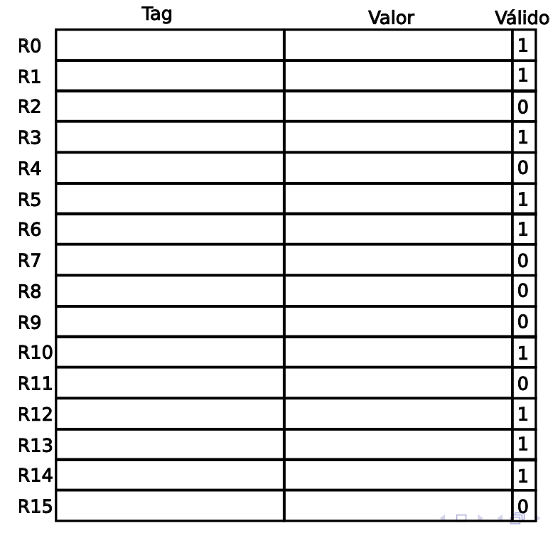

# Teo 5 - Resumen.

La CPU es una máquina de ejecución. 

1. Búsqueda de instrucción - Opcode Fetch 
2. Decodificación de la instrucción - Decode
3. Búsqueda de operandos - Operand Fetch
4. Ejecución - Execute
5. Resultado - Write Back

Antes, todas estas etapas se hacían secuencialmente. Los procesadores asignaban un ciclo de clock a cada una y toda la CPU estaba dedicada a esa tarea.

Se empezó a paralelizar el proceso: 

### Instruction Level Paralelism (ILP).

- Requiere muy poco HW adicional.
- Se logra si todos los bloques funcionales trabajan en paralelo, cada uno en una instrucción diferente.
- Cada parte se denomina **stage (etapa).**

— Dibujito situación ideal —

La idea es que los modelos reales se aproximen lo máximo posible a este.

Una estrategia es el deep pipeline, que pasa de 5 etapas a 8. ¿Qué es lo que cambia cuando agregás más etapas?

### Eficiencia de un Pipeline

TPI = Time Per Instruction

TPI = Tiempo por instrucción en la CPU “no pipeline” / cantidad de etapas

Pareciera que cuantas más etapas agregamos, el tiempo de instrucción baja. Pero en la práctica existen overheads introducidos por el pipeline que suman pequeñas demoras a cada ejecución.

<aside>
💡 El pipeline no reduce el tiempo de ejecución de cada instrucción,  incrementa el número de instrucciones completadas por unidad de tiempo.

</aside>

## Obstáculos del pipeline

Hay obstáculos que conspiran contra la eficiencia de un pipeline. Se pueden agrupar en 3 categorías:

- Obstáculos estructurales
- Obstáculos de datos
- Obstáculos de control

Al efecto ocasionado por un obstáculo se lo llama **pipeline stall.** Esto sucede cuando un obstáculo no se puede esquivar y degrada la performance del procesador respecto del comportamiento ideal.

### Obstáculos estructurales

Se pueden dar por varias razones:

- Una etapa no está lo sufucientemente “achicada”, lo que hace que para completarse requiera de más de un ciclo de clock.
- Dos instrucciones que utilizan una etapa están más próximas en el tiempo que el tiempo que se necesita para procesar esa etapa. Hay un conflicto de recursos porque es como si se juntaran 2 instrucciones en la misma etapa y una tendrá que detenerse y aumentará la cantidad de ciclos por instrucción.

Un ejemplo es cuando un procesador quiere ir a memoria a buscar una instrucción pero en esa misma etapa se quiere ir a memoria para buscar operandos. Entonces, cuando se intercalen, uno de estos dos fetchs va a tener que detenerse. 

Un criterio posible es darle preferencia a la instrucción de la función que ya se estaba ejecutando, o sea que se haga el fetch de datos mientras el de instrucción espera. Esto provoca que las siguientes etapas esperen 1 ciclo más de clock.

— Dibujito Obstáculos Estructurales —

Posibles soluciones:

En cualquiera de las soluciones sería necesario agregar HW.

- Dividir la caché L1 en caché de datos y caché de instrucciones.
- Emplear buffers de instrucciones implementadas como colas FIFO.
- Ensanchar los buffers más allá del tamaño de palabra y poder leer más cosas en cada ciclo de clock.

### Obstáculos de datos

Se producen cuando una instrucción requiere un dato antes de que esté disponible: 

```wasm
1. dadd r1, r2, r3 "r1 = r2 + r3"
2. dsub r4, r1, r5 "r4 = r1 - r5"
3. and r6, r1, r7
4. or r8, r1, r9
5. xor r10, r1, r11

"Es posible que estemos usando r1 en el resto de las operaciones sin siquiera 
haberle asignado la suma en la operación 1."
```

Para poder ejecutarse la segunda instrucción tiene que terminar de ejecutarse la primera, por lo que no vamos a poder hacer el fetch de los operandos de la instrucción 2 (fetchear r1) hasta que la instrucción 1. no devuelva su resultado.

— dibujito obstáculo de datos —

Una posible solución es hacer **forwarding.** Como en la etapa 4 ya conocemos el resultado, en vez de devolverlo (etapa 5) podemos pasárselo directo a la etapa 3 de la siguiente instrucción y hacer esas 2 etapas a la vez.

— dibujito forwarding —

### Obstáculos de control

La peor situación en pérdida de performance, es un branch (una discontinuidad en el flujo de ejecución). El branch hace que todo lo que se estaba pre-procesando deba descartarse y que el pipeline se vacíe. A este efecto se lo conoce como **branch penalty**. 

El principal inconveniente se tiene cuando el salto es condicional, ya que es necesario determinar si la condición es true (branch taken) o false (branch untaken).

¿Cuándo se puede determinar si un salto es taken o no?

- Si es un salto condicional, en la **fase de ejecución**.
- Si es un salto incondicional o llamada a subrutina con direccionamiento indirecto, en la **fase de búsqueda de operando**.
- Si es un salto incondicional o llamada a subrutina con direccionamiento directo, en la **fase de decode**.

El forwarding puede ayudar a disminuir el efecto de estos obstáculos, pero no es óptima. Hay que recurrir a análisis mejores, con predicción de saltos y análisis del comportamiento de los algoritmos.

## Unidades de predicción de saltos

Cuanto más profundo es un pipeline (más etapas tiene), más grande es la penalización de un branch. Luego, el tiempo que demora un pipeline en recuperarse es proporcional a su cantidad de etapas.

Por eso, es **crucial** poder **predecir los saltos**, para minimizar las penalizaciones. (¿Para que el agujero no sea tan grande y pueda empezar a fetchear antes?)

### Predicted-non-taken

El procesador asume, por default, que el salto nunca se toma. Esto funciona especialmente cuando el salto es “hacia adelante”. 

```wasm
instrucción branch
instrucciones sucesoras secuenciales
instrucción destino de branch taken
```

### Predicted-taken

El procesador asume que el salto se toma siempre. Funciona bien en los ciclos, porque sabemos que en general se hacen muchas veces. Sólo falla en la última iteración, cuando la condición del ciclo expira.

```wasm
instrucción destino
grupo de instrucciones
instrucción branch
```

### Delayed branch y Loop Unrolling (desarrollar)

La instrucción sucesora se ejecuta siempre, independientemente del resultado del branch.

```wasm
instrucción branch
instrucción sucesora
instrucción destino branch taken
```

## Predicción de saltos dinámica

Todos los métodos hasta acá dependían exclusivamente del compilador. Ahora veremos qué pasa cuando el procesador es el que analiza y toma decisiones. Ingresamos al universo de la predicción dinámica.

### Branch Prediction Buffer

Es una tabla simple indexada por la dirección de memoria de la instrucción de salto y un bit que indica simplemente el resultado reciente del salto (taken o untaken).

“Si la última vez no lo tomó, no lo tomo”. No da seguridad de nada, es una predicción basada en el último salto. Si se equivoca, cambia el bit del salto para la próxima predicción.

Se crea también la predicción de 2 bits, para evitar el caso en el que hay 2 predicciones fallidas seguidas.

— dibujito predicción 2 bits — 

Se implementa en la etapa de fetch como un pequeño caché de direcciones. 

Otra forma de implementación es .... terminar.

### Branch Target Buffer

Es un caché de instrucciones de salto que contiene, en cada entrada, el par <dirección de la instrucción de salto, dirección del target resuelta la últiuma vez>. Se accede mediante el valor completo del program counter.

Si no se encuentra el valor en el BTB, se asume taken. Si el resultado es taken, se agrega el valor al BTB. Si es non taken, se acepta el delay en el pipeline y no se almacena nada en el BTB.

Si se encuentra el valor, se aplica el campo de dirección target almacenado. Si el resultado es taken, no hay penalidad y no se guarda ningún nuevo valor. Si es non taken, guarda el nuevo valor en el BTB luego de la penalidad correspondiente en el pipeline.

# Procesadores Superscalar

El objetivo es ejecutar más de una instrucción por ciclo de reloj.

¿Cómo? Con más paralelismo.

— dibujo superscalar de 2 vías —

Contras:

- Más paralelismo → más obstáculos.
- Los obstáculos estructurales quedan más expuestos.
- Recordando el problema del acceso simultáneo a memoria, ahora, además de tener que lidiar con otras etapas del mismo pipeline, hay que lidiar con las mismas etapas del otro pipeline.
- Se podría ejecutar en 2 ALUs diferentes, pero si una instrucción depende de la otra no.
- Una falla en branch es letal. Borra TODO.

# Scheduling Dinámico

Hasta ahora venimos estudiando pipelines con scheduling de instrucciones estático, en los que se busca una instrucción y se la envía a la unidad de ejecución (**dispatch**).

En caso de que una instrucción se “choque” con otra en el pipeline, el envío es demorado (**pipeline stall**).

En el caso de los superscalar, el estudio de dependencias/choques se debe extender a instrucciones en los diferentes pipelines. Esto vuelve insuficiente el método forwarding. 

**Idea del Scheduling Dinámico:**

Si una instrucción $j$ depende de una instrucción $i$, que para completarse requiere de varios ciclos de clock adicionales debido a obstáculos, la instrucción $j$ y todas las instrucciones que la siguen no pueden ser ejecutadas. (Pipeline stall).

Esta obstrucción del pipeline deja en estado IDLE a todas las unidades funcionales que componen la unidad de ejecución del pipeline.

```wasm
divd F0, F2, F4
addd F10, F0, F8
subd F8, F12, F14 
```

La ejecución del `divd` obstruye la ejecución del `addd` porque tiene que esperar a que se guarde el resultado en F0.

La instrucción `subd`, a pesar de no guardar dependencia con las instrucciones previas, queda esperando que se complete la instrucción responsable del “atasco”.

---

### Ejecución Fuera de Orden

la ejecuci ́on en orden no siempre ofrece un rendimiento  ́optimo debido a las dependencias que pueden existir entre las distintas instrucciones que un compilador no puede resolver.

Consiste en enviar instrucciones a éjecución, independientemente del orden en el que están, pero manteniendo un orden lógico determinado por las dependencias entre las distintas instrucciones. 

¿Con qué criterio? La decisión se toma una vez decodificada la instrucción, ya que ahí se sabe si hay un atasco que provoque un pipeline stall en instrucciones siguientes.

Cada vez que intentemos hacer esto hay que tener en cuenta los riesgos: 

- divd demora varios ciclos y atasca a addd.
- es posible enviar subd.
- hay riesgo de que se escriba en F8 en la instrucción 3, cuando F8 es operando de la instrucción 2.
- también puede pasar que la instrucción 4 escriba en el mismo destino que la 2.

— dibujo ejecución fuera de orden —

Riesgos: 

- WAR (Write After Read): que se escriba en un registro que es operando de una instrucción anterior.
- WAW (Write After Write): que se escriba en un registro en el que se iba a escribir en una instrucción anterior.
- RAW (Read After Write): Es cuando se lee un operando que una instrucción previa aún está por cambiar. Esto no pasa en OOO.

Al ejecutar Fuera de Orden, el procesador puede generar lo que se denominan **excepciones imprecisas.** 

Se producen en la fase de ejecución y se da cuando el estado del procesador no es el mismo del que sería si las instrucciones se hubiesen ejecutado en orden. Se dan por 2 posibles razones: 

1. El pipeline ejecutó una o más instrucciones posteriores a la que produce la excepción.
2. El pipeline no ha completado aún al menos una instrucción previa a la que genera la excepción.

---

¿Cómo implementar OOO?

**Scoreboarding:** evitaba los riesgos WAR y WAW en el 1964. Era muy limitada.

### Algoritmo de Tomasulo (1967)

Su interés fue minimizar los riesgos de RAW e implementar *Register Renaming* en los WAR y WAW, neutralizándolos. Para eso, implementó un método conocido como **Register Renaming**, usando *buffers* llamados **Reservation Stations**.

¿Qué necesita un procesador para implementarlo?

1. Mantener un link entre el **productor** y el **consumidor** de un dato.
2. Mantener instrucciones en espera hasta que estén listas para su ejecución.
3. Las instrucciones deben saber cuando sus operandos están *ready*.
4. Disparar la instrucción cuando todos los operandos estén *ready.*

1. Enlace entre productor y consumidor/es.
    
    ¿Cómo se produce el link entre el productor del dato y sus consumidores? **Register renaming:** permite asociar un tag con cada operando, que usaremos para identificar al registro de la **Reservation Station** que contiene la instrucción que producirá su valor. Este tag lo conseguimos en la **Register Alias Table**.
    
    ```coffeescript
    div.d F0, F2, F4
    add.d F6, F0, F8 # Riesgo WAR con F8 en sub
    s.d   F6, O(R1)
    sub.d F8, F10, F14
    mul.d F6, F10, F8 # Riesgo WAW.
    ```
    

Se hace análisis del código de manera de “mirar más adelante” de cada instrucción en busca de estos riesgos.

Se implementa mediante la Register Alias Table.

Consiste en una tabla en la que cada Registro tiene una entrada, que contiene un tag, un valor y un bit de validez.

En el tag se escribe el renombre del registro. Al prinicpio empieza con el bit de validez en 0 y en valor el valor actual.



### Reservation Station

Las instrucciones, para ser despachadas, tienen que esperar en el **Reservation Station**. Son aquellas instrucciones que deberían estar en ejecución pero no están en *ready* porque les falta algún operando o algo así.

En la reservation station vamos a tener todos los operandos de cada instrucción marcados como ready o no. En definitiva, termina siendo un gran *buffer* en el cual se colocan las instrucciones hasta que estén *ready*.

Cada vez que una unidad de ejecución pone disponible un operando (o sea que termina de ejecutar una instrucción), hace broadcast y le manda su tag y su valor a todas las Reservation Stations. Todas estas van a fijarse si tienen ese tag, y en caso de que lo tengan, van a pisar el valor y marcar el operando como ready. Si un operando recibe múltiples escrituras, la Reservation Station aplica sólo la última. 

Ahora, como el bit de validez está en 1, la lógica no va a mirar el tag sino directamente el valor.

Cuando todos los bits de validez de cada operando de la instrucción estén en 1, la instrucción va a estar *ready* y será despachada.

- Si no hay ninguna unidad funcional disponible, la instrucción se encola y espera.
- Si la RS tiene muchos más registros que la arquitectura se pueden eliminar los riesgos estudiados (WAR, WAW).

Entonces, no puede pasar que una instrucción cuya ejecución se adelanta respecto de otra, modifique o utilice un registro de la instrucción previa y que ésta luego use una copia incorrecta del mismo.

— dibujo FPU IBM sin y con Tomasulo —

Tomasulo agrega 2 reservation stations (una con 3 y otra con 2 registros). También está el common data bus, que el crucial en el broadcast de los resultados porque atraviesa la salida de todas las unidades funcionales y pasa por las Reservation Stations.

**Etapas por las que pasa una instrucción en Tomasulo:**

- Fetch:
- Issue: el procesador determina a cuál RS tiene que despachar la in. trucción, basado en la unidad funcional que la requiere. Si no hay ninguna unidad funcional disponible, la instrucción se ***stallea*** y espera a que se vacíe algún espacio.
    
    Una instrucción puede ser despachada a pesar de que sus opeandos aún no estén disponibles. Lo que va a pasar es que se va a estar monitoreando el CDB esperando a que alguna unidad funcional envíe el tag y el nuevo valor del operando que nos falta, una vez que haya terminado de calcularlo.
    
- Execute: una vez que todos los operandos están disponibles y la unidad funcional correspondiente puede aceptar una nueva instrucción, la operación ya puede ser ejecutada.
- Write Result: cuando el resultado esté disponible, se envía el valor junto con el tag de la RS que produjo el resultado a través del Common Data Bus, entregando el resultado a la RAT y a las Reservation Stations que lo esperaban.

<aside>
💡 Los tags en el esquema de Tomasulo (en la RAT) hacen referencia a los registros de la RS que producirá el resultado, y el nombre original de los registros fuente son descartados cuando la instrucción se despacha a una Reservation Station.

</aside>

El uso de RS trae 2 propiedades importantes:

- La detección de dependencias y el control de ejecución son distribuidos, porque la información almacenada en las RS de cada unidad funcional determina cuándo una instrucción puede ser ejecutada en esa unidad.
- Todos los resultados son broadcasteados por el CBD, que se conecta a los registros, RAT, RS y buffers, evitando tener que pasar primero por los registros para luego actualizar el resto de las unidades. De esta manera, si varias unidades funcionales están esperando un operando resultado, podrían ejecutar la instrucción de forma simultánea al momento de recibir el broadcast de ese operando. Si se tuviera un banco de registros centralizado, las unidades deberían ir a ese banco a leer sólo cuando los buses estuvieran disponibles (eso se hacía en *scoreboarding*).

```wasm
Algoritmo de Tomasulo

if (RS tiene recursos disponibles):
	Se inserta en la RS la instrucción y los operandos renombrados <valor, tag>

else:
	stall 

for (cada instrucción en la RS):
	Mirar el tráfico en el Common Data Bus en busca de tags que correspondan a sus operandos.
	if (se detecta un tag):
		pisar el valor
	if (todos los operandos están ready):
		marcarse como ready

if (unidad funcional disponible):
	despachar esa instruccion a esa unidad funcional

if (finalizada la ejecución de la instrucción):
	la unidad funcional arbitra el CBD.
	Poner el valor al tag en el CBD (tag broadcast)
	if (el archivo de registros está conectado al CBD):
		if (tag del archivo de registro == tag broadcast):
			registro = tag broadcast.

```

---

```coffeescript
# Pipeline: Fetch-Decode-Execute-Result-Write

loa d R1, 0 (R3) #ptr
mul R6, R1, R2
add R11, R11, R6
sub R3, R3, R2
add R7, R8, R8
add R20, R8, R3

# La 1era instr. demora 12 ciclos de clock en ejecutarse.
# mul tarda 4 ciclos de clock.
# El resto demora 1 ciclo cada una.
```

El tag que le ponemos a un registro tiene que coincidir con una entrada en la Reservation Station de alguna unidad funcional. Puede haber 1 o tantas RS como unidades funcionales, pero no se pueden repetir los tags. 

### Ejecución Especulativa - Reorder Buffer

Volvemos a *branch prediction.* A medida que aumentamos el paralelismo a nivel de instrucciones, se va complicando el control de dependencias. La predicción de saltos permite reducir los *stalls* asociados a los *branches* pero no podemos ejecutar estas instrucciones hasta que no sepamos la evaluación del branch, ya que no se pueden deshacer esos resultados. Esto representa una gran pérdida de tiempo.

Es posible superar estas dependencias de control **especulando** sobre la evaluación de los *branches.* Es una extensión de la predicción de saltos con *scheduling* dinámico. Vamos a fetchear, despachar y ejecutar las instrucciones como si nuestras predicciones fueran correctas, pero hay que tener la capacidad de **deshacer la operación** en caso de que la especulación no haya sido correcta.

Vamos a permitir que las instrucciones sean ejecutadas fuera de orden, pero forzar a que se commiteen en orden, para evitar cualquier acción irreversible.

Entonces, primero se broadcastean los resultados de las instrucciones (que fueron ejecutadas de forma especulativa) y luego, una vez que sepamos la evaluación del *branch,* se comitean los resultados.

Para implementar esto, se introduce el ***Reorder Buffer* (ROB).**

El ROB es un buffer con punteros *head* y *tail.* Cuando una instrucción es despachada, la próxima entrada del ROB, apuntada por el *tail,* es asignada a esa instrucción. El número de esa entrada termina siendo usado como *tag* para el renaming. Luego, el puntero a *tail* es incrementado.

De esta manera, las instrucciones ejecutadas de forma especulativa se van almacenando en el ROB, hasta que esos resultados sean comitteados. Así, la ejecución se mantiene fuera de orden pero la aplicación de los resultados es en orden.

Suponiendo que tenemos varias instrucciones, de las cuales la primera no está lista pero la segunda y la tercera sí, todavía no aplicamos nada. Ahora, cuando la primera instrucción se marque válida, ya aplicamos las 3 y corremos la “ventana” 3 lugares para abajo.

Cuando trabajamos con ejecución especulativa, el banco de registros no es actualizado hasta el commit de los resultados, o sea, hasta qeu tengamos la certeza de que esa instrucción es válida. Mientras tanto, el ROB se encarga de mantener la última versión de los registros. hasta que los resultados de las instrucciones anteriores sean commiteados.

Cada entrada del ROB tiene 4 campos:

- El tipo de instrucción. Indica si se trata de un branch (no tiene operando), un store (tiene como destino una dir. de memoria) o una operación con registros.
- El campo destino. Contiene el número de registro o dirección de memoria en donde se guardará el resultado.
- El campo valor. Para mantener el resultado de la instrucción, hasta el commit.
- El bit de ready. Indica si la ejecución ya fue ejecutada, por lo que el campo valor sería válido.

También podría haber un poison bit, que indica si la instrucción ejecutada generó una excepción. Esta excepción podría ser innecesaria (depende del branch).

**Etapas de una instrucción usando ROB:**

- **Issue (envío)**: se obtiene la primera instrucción de la cola de prebúsqueda. La instrucción es despachada a una RS de la unidad funcional correspondiente a la instrucción (si hay espacio) y si tenemos una entrada disponible en el ROB.
    
    Si no hay un RS disponible o no hay un slot libre en el ROB, hay un obstáculo estructural, por lo cual la instrucción queda bloqueada (stall).
    
    Cuando se envía la instrucción, se hace junto con los datos correspondientes a sus operandos, si estos están disponibles en sus registros.
    
    Luego, se actualizan las estructuras internas con la información pertinente.
    
- **Ejecución:** si uno o más operandos no están disponibles, se ve el CBD hasta que lleguen los resultados. De esta manera, se resuelven los RAW. Cuando están disponibles todos, se ejecutan.
- **Write Result**: cuando el resultado está disponible, se escribe en el CDB con el tag que se obtuvo del ROB para broadcastear el resultado. Esto se escribe en el ROB, en los RS y en el registro correspondiente. Se setea el bit de validez para ese operando.
- **Commit:** luego de esto el resultado sólo estará en el operando destino.
    
    Pueden pasar 3 cosas distintas en esta etapa, dependiendo del tipo de instrucción (branch, store, “normal”).
    
    - Si es un branch con predicción incorrecta, flushea las entradas del ROB y recomienza a partir de la instrucción sucesora correcta del branch.
    - Para cualquier instrucción que finaliza correctamente (excepto memory stores) y para los branches con predicción correcta, se copia el valor del ROB en el operando destino.
    - Si la operación es un memory store es similar solo que se escribe en una dirección de memoria.